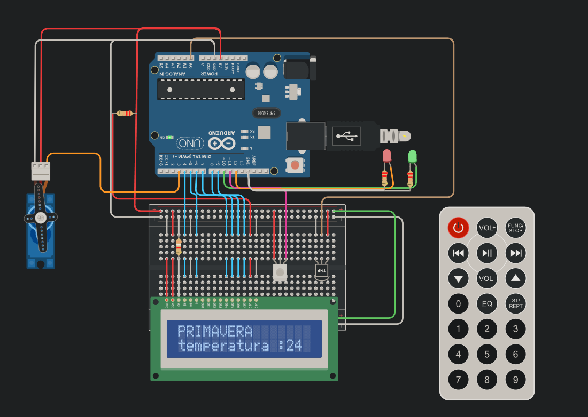

## ALUMNO

* Figueroa Fernando

## Proyecto: Sistema de incendio con Arduino




## DESCRIPCION

El objetivo de este proyecto es diseñar un sistema de incendio utilizando Arduino que pueda
detectar cambios de temperatura y activar un servo motor en caso de detectar un incendio.
Además, se mostrará la temperatura actual y la estación del año en un display LCD.


## Funcion principal :stuck_out_tongue_closed_eyes:

```void funcionPrincipal(int conversor)
{

     if (conversor <= 0)
      {
        lcd.setCursor(0,0); //ubicados en el eje X y Y
        lcd.print("INVIERNO");
        darGiroServo(180,0,6000,1);

      }
      else if (conversor > 0 && conversor < 20)
      {
        lcd.setCursor(0,0);
        lcd.print("OTONIO");
        mostrarTemperatura(conversor);
          darGiroServo(0,90,5000,1);

      }
      else if (conversor >= 20 && conversor < 30)
      {
        lcd.setCursor(0,0);
        lcd.print("PRIMAVERA");
        mostrarTemperatura(conversor);
        darGiroServo(0,90,4000,1);

      }
      else if (conversor >= 30 && conversor < 50)
      {
        lcd.setCursor(0,0);
        lcd.print("VERANO");
        mostrarTemperatura(conversor);
        darGiroServo(0,180,3000,1);
      }

      else if (conversor > 60)
      {

          lcd.setCursor(0,0);
          lcd.print("!!!INCENDIOOO");
          mostrarTemperatura(conversor);	
          darGiroServo(0,200,500,0);		
      }
}
    
 
```
Recibe por parametro un estado, en este caso ese estado(conversor) es mi temperatura y la cual me dice si en este momento esta ocurriendo un incendio o en que estacion del año me encuentro ubicado. **¿¡Como es posible esto!?** si conversor me llega con un numero menor o igual a 0 me encuentro en la estacion INVIERNO,lo mismo para cada estaciones pero con diferentes condiciones en el conversor. en el lcd imprimo no solo la estacion del año sino que tambien imprimo la temperatura. **¿en que momen imprimo tales cosas?** en la 2 primeras lineas de cada condicinional **IF** imprimo las estaciones del año y en la linea que llamo a la funcion **mostrarTemperatura(conversor);** estoy imprimiendo la temperatura en el lcd.
Por ultimo se ve en la linea de codigo que llamo a la funcion **darGiroServo(0,200,500,0)**. ¿Que hace esta funcion? 

### Funcion SERVOMOTOR

``` void darGiroServo(int primerGiro ,int segundoGiro, int tiempo,int bandera)
{
   //funcion que hace dar vueltas a mi servo en determinado tiempo 
 	 PinControlServo.write(primerGiro);
     delay(tiempo);
     PinControlServo.write(segundoGiro);
     delay(tiempo);
  if (bandera == 1)
  {
    prendeYApagaLed(Led_Green,1000,1);
  }
  else
  {
   prendeYApagaLed(Led_Red1,1000,1);
  }
}

```

esta funcion practimante le dice al servomotor en cuantos grados debe girar y en cuanto tiempo.Los giros y el tiempo los recibe por paramatro que se lo pasamos en la funcion antes vista, otro dato curioso de esta funcion es que si al parametro bandera le paso un 1 me va a encender un led verde,si le paso cualquier otra cosa me enciende un led rojo.
PinControlServo.write() es el que muevo el servo. ¿ Y que esto? esto basicamente es un objeto que lo definimos mas arriba. 
**Servo PinControlServo** al objeto Servo le asigno una variable llamada PinControlServo que es la que me va controlar todo lo que tenga que ver con el cervomotor


## LINK TINKERCARD :see_no_evil:
**https://www.tinkercad.com/things/6oszydiP1YU**
